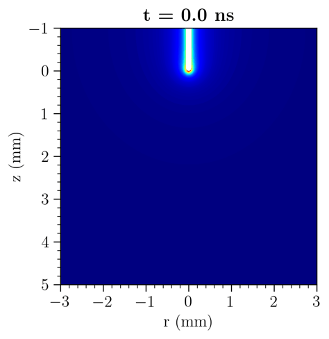

# captionFOAM
Cold Atmospheric Plasma Tool for IONised gases based on OpenFOAM

## Description
**captionFOAM** is an extension of OpenFOAM for the finite-volume modelling of cold atmospheric plasmas (CAPs). It augments OpenFOAM with custom libraries and solvers for low-temperature plasma discharges, solving the coupled drift-diffusion transport equations for charged species, Poisson's equation for the electric field. Transport coefficients and reaction rates are obtained as functions of either the reduced electric field E/N (LFA - Local Field Approximation) or the mean electron energy $\varepsilon_m$ (LMEA - Local Mean Energy Approximation).

A dedicated Python-based preprocessing toolkit provides built-in coupling with the BOLSIG+ freeware. The toolkit downloads BOLSIG+, utilises reaction cross-section data from the LXCat database, executes BOLSIG+, parses its output, and generates OpenFOAM-compatible lookup tables in a user-friendly way, ensuring consistency between the kinetic data and the solver inputs.


captionFOAM currently provides two standalone solvers, addressing different levels of complexity and accuracy in describing the plasma:


1. `plasmaReactingFoam` — a detailed chemistry solver that resolves multi-species transport coupled with Poisson's equation, enabling the simulation of discharge propagation and reactive species formation.
2. `threeSpeciesFoam` — a reduced three-species model (electrons, positive ions, negative ions), designed for computational efficiency and robustness.

## Features
- **Two solvers, two levels of fidelity** — a detailed multi-species chemistry solver (`plasmaReactingFoam`) and a reduced three-species model (`threeSpeciesFoam`), letting you trade accuracy against computational cost.
- **LFA and LMEA** — transport and reaction coefficients as functions of either the   reduced electric field E/N (Local Field Approximation) or the mean electron energy (Local Mean Energy Approximation).
- **Built-in BOLSIG+ coupling** — a Python preprocessing toolkit retrieves LXCat cross-section data, runs BOLSIG+, and generates OpenFOAM-compatible lookup tables automatically, keeping kinetic data and solver inputs consistent.
- **Flexible voltage input** — accepts arbitrary applied voltage waveforms, including but not limited to DC, AC, and pulsed.
- **Automatic chemistry parsing** — reaction mechanisms are parsed using OpenFOAM'sexisting tools.
- **Native multiphysics coupling** — built within the OpenFOAM framework, so the plasma solvers couple readily with fluid dynamics and other OpenFOAM physics.
- **OpenFOAM meshing and geometry** — build and mesh geometries directly with OpenFOAM's native tools.
- **Strongly coupled discharge dynamics** — self-consistent solution of charged-species transport and Poisson's equation, capturing discharge propagation and reactive species formation.


## Build status
captionFOAM is currently in **beta**.

## Installation guide
captionFOAM requires [OpenFOAM v2312](https://www.openfoam.com/) or newer. With OpenFOAM installed and its environment sourced, clone the repository to a location of your choice and run the install script:

```bash
git clone https://github.com/InSilicoModellingGroup/captionFOAM.git
cd captionFOAM
./install.sh
```

## Examples

- **Pin to plate**
A classical 2D axissymetric pin-to-plate configuration using air chemistry operating under 10kV DC applied voltage and a 5 mm gap distance.


## License
captionFOAM is released under the GNU General Public License v3.0 (GPL-3.0).

## Acknowledgements
This work was partially funded by the European Union's Horizon 2020 research and innovation programme under the Marie Skłodowska-Curie Action (Grant Agreement 101034403), the Horizon-EIC-2023 Pathfinder Open (Grant Agreement 101129853), and UKRI (Grant Agreement 10106237).

## Developers
captionFOAM is developed by the [In Silico Modelling Group](https://in-silico-modelling.ucy.ac.cy/) at the University of Cyprus.

- Core developer: — [George Vafakos](https://github.com/GeorgeVafakos)
- Supervision: — [Vasileios Vavourakis](https://github.com/vasvav), [Pambos Anastassiou](https://github.com/pambosana)

<!-- ## Citation -->

## Contact
vafakos.georgios@ucy.ac.cy

vavourakis.vasileios@ucy.ac.cy